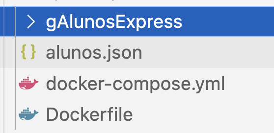

# Docker Tutorial
## 2024-04-27 @jcr

---

## Sinopsis

Neste documento, descreve-se a criação de containers Docker como uma forma de encapsular aplicações web de modo a facilitar a sua distribuição e gestão quando em execução.

O tutorial começa com exemplos simples de websites estáticos que vão evoluindo até aplicações complexas com vários serviços a ter que serem orquestrados.

---

## Docker1: Website estático do Bullarium Bracarensis

A versão HTML+CSS do Bullarium Bracarensis resultou de um trabalho final de uma UC de projeto, designada Opção III, lecionada à antiga Licenciatura em Engenharia de Sistemas e Informática, por José Luis Santos.

Neste exemplo, decidiu-se aproveitar um website estático interessante e encapsolá-lo num container Docker que o pudesse servir por HTTP.

Para isso, na imagem Docker a criar é preciso incluir, além das páginas HTML e das folhas de estilo CSS, um servidor web. Qualquer servidor serve, se bem que a configuração de cada um poderá ser diferente.

Vamos criar várias versões com vários servidores web.
---

### nginx

Nesta primeira versão foi usado o `nginx`.

#### Dockerfile para website estático + nginx

```
FROM nginx
COPY . /usr/share/nginx/html
```

Na primeira linha indica-se a imagem de base que será usada, neste caso, a imagem do `nginx`.
A seguir copiam-se os ficheiros que constituem o website para a pasta a partir da qual o `nginx` serve os conteúdos, neste caso a pasta é `/usr/share/nginx/html`.

Para colocarmos o container em execução basta saber que o servidor web responde na porta interna do contaier com o identificador `80`. Vamos mapeá-la numa porta externa, por exemplo `2804`:

```bash
$ docker run -d -p 2804:80 --name bb engweb2024/bb
```

Podemos observar o container em execução: `docker ps`.

### Apache

Para termos um container com o apache só temos de alterar a imagem base e mudar a pasta onde se coloca o website.

#### Dockerfile para website estático + apache

```
FROM httpd:latest
COPY . /usr/local/apache2/htdocs/
```

Colocamos em execução om uma linha de comando semelhante, uma vez que o apache responde também na porta `80` interna:

```bash
$ docker run -d -p 2804:80 --name bb engweb2024/bb_apache
```

Podemos observar o container em execução: `docker ps`.

```
CONTAINER ID   IMAGE                  COMMAND                  CREATED         STATUS         PORTS                      NAMES
44611bca30f4   engweb2024/bb_apache   "httpd-foreground"       9 minutes ago   Up 9 minutes   0.0.0.0:2804->80/tcp       bb
```

E depois de algumas interações com o website podemos observar os seus logs:

```
192.168.65.1 - - [28/Apr/2024:17:35:42 +0000] "GET / HTTP/1.1" 200 293
192.168.65.1 - - [28/Apr/2024:17:35:42 +0000] "GET /bbtoc.html HTTP/1.1" 200 40108
192.168.65.1 - - [28/Apr/2024:17:35:42 +0000] "GET /bbcts.html HTTP/1.1" 200 710320
192.168.65.1 - - [28/Apr/2024:17:35:42 +0000] "GET /bbtoc.css HTTP/1.1" 200 1167
192.168.65.1 - - [28/Apr/2024:17:35:42 +0000] "GET /bbcts.css HTTP/1.1" 200 851
192.168.65.1 - - [28/Apr/2024:17:35:43 +0000] "GET /favicon.ico HTTP/1.1" 404 196
```


### Python

Para termos um container com o python temos de configurar mais algumas coisas.

#### Dockerfile para website estático + python

```
FROM python
WORKDIR /usr/src/app
COPY . .
CMD ["python", "-m", "http.server", "80"]
```

O comando `WORKDIR` permite definir qual a pasta dentro container que será o alvo por omissão dos comandos seguintes, neste caso, definimos a pasta `/usr/src/app` que é onde o servidor web do python irá procurar as páginas do website. 

A seguir, copiamos o nosso website. O primeiro `.` indica a pasta onde está a Dockerfile e o segundo `.` indica a pasta definida no `WORKDIR`.

Como o servidor web é um módulo python que tem de ser colocado em execução, precisamos de executar uma linha de comando com vários argumentos. A forma de o fazer é com o comando `CMD` seguido de uma lista com os argumentos na forma de string.

Depois de construirmos a nossa imagem, podemos colocá-la em execução como um container com uma linha de comando semelhante às anteriores, uma vez que configuramos o servidor web do python para responder na porta `80` interna:

```bash
$ docker build . -t engweb2024/bb_python
$ docker run -d -p 2804:80 --name bb engweb2024/bb_python
```

Podemos observar o container em execução: `docker ps`.

---

## Docker2: Aplicações com nodejs

Apresentam-se a seguir alguns exemplos de complexidade crescente para aplicações web desenvolvidas com o nodejs.

### Nodejs: Hello world!

Esta é aplicação web mais simples, materializada num servidor que apenas responde com uma mensagem de texto.

#### Serviço web

```js
var http = require('http')

http.createServer(function (req, res) {
    res.writeHead(200, {'Content-Type': 'text/plain; charset=utf-8'});
    res.end('Olá turma de 2024! Esta é a versão 3 do servidor...');
}).listen(7777);
console.log('Servidor à escuta na porta 7777...')
``` 

Para encapsular este serviço num container docker criou-se a seguinte especificação:

```
# Indicamos a imagem de base
FROM node
# Criamos a pasta de trabalho dentro da imagem
WORKDIR /app
# Copiamos a nossa app para lá
COPY server1.js .
# Expomos a porta em que irá correr
EXPOSE 7777
# Indicamos como arrancar a aplicação
CMD [ "node", "server1.js" ]
``` 

### Nodejs: json-server

O `json-server` é um utilitário interessante para criar API de dados em pouco tempo, possibilitando a rápida demonstração e teste de ideias. Está desenvolvido em `nodejs` e pressupõe que a base de dados está num ficheiro JSON seguindo uma determinada estrutura.

#### Base de dados em JSON de uma escola de música: alunos, cursos e instrumentos

Exemplo da base de dados que se irá usar (aqui apenas se colocou um registo por coleção):

```json
{
  "alunos": [
    {
      "id": "A1510",
      "nome": "ADEMAR FONTES DE MAGALHAES GONCALVES",
      "dataNasc": "1999-4-19",
      "curso": "CB8",
      "anoCurso": "5",
      "instrumento": "Guitarra"
    }],
  "cursos": [
    {
      "id": "CB1",
      "designacao": "Curso Básico de Clarinete",
      "duracao": "5",
      "instrumento": {
        "id": "I1",
        "#text": "Clarinete"
      }
    }],
  "instrumentos": [
    {
      "id": "I1",
      "#text": "Clarinete"
    }]
}
```

#### Dockerfile

Segue-se a especificação para encapsular o `json-server`:

```
# Use a imagem nodejs como base
FROM node
# Defina a pasta de trabalho como /app
WORKDIR /app
# Copie a BD para o diretório de trabalho
COPY db.json .
# Instale as dependências
RUN npm install json-server -g
# Exponha a porta 3000
EXPOSE 3000
# Defina o comando padrão a ser executado quando o container for iniciado
CMD ["json-server", "--watch", "db.json", "--port", "3000", "--host", "0.0.0.0"]
```

Para colocar em execução e testar podemos fazer:

```bash
$ docker build . -t engweb2024/jserver_musica --no-cache
$ docker run -d -p 3000:3000 --name musica engweb2024/jserver_musica
$ docker logs musica -f
```

O último comando permite-nos observar o que aconteceu no container quando se tentou colocar em execução:

```
JSON Server started on PORT :3000
Press CTRL-C to stop
Watching db.json...

( ˶ˆ ᗜ ˆ˵ )

Index:
http://localhost:3000/

Static files:
Serving ./public directory if it exists

Endpoints:
http://0.0.0.0:3000/alunos
http://0.0.0.0:3000/cursos
http://0.0.0.0:3000/instrumentos

```

#### Desafio

Crie um container para o mapa virtual cujo ficheiro JSON se encontra na mesma pasta.

### Nodejs: express + json-server

Neste exemplo, resolvemos isolar uma aplicação constituída por 2 serviços: uma API de dados sobre uma coleção alunos e um serviço que consome esta API de dados e responde ao utilizador com páginas HTML onde a informação é exposta de forma mais agradável e funcional.

Esta é a estrutura da aplicação:



Um ficheiro JSON que iá alimentar a API de dados, `alunos.json`, que será materializada num `json-server` (imagem especificada na `Dockerfile`), uma orquestração que irá combinar esta API com a aplicação que está na pasta `gAlunosExpress`.

A `Dockerfile` para o `json-server` é semelhante às que vimos anteriormente:

```
FROM node
WORKDIR /app
COPY alunos.json .
RUN npm install json-server -g
EXPOSE 3000
CMD ["json-server", "--watch", "alunos.json", "--port", "3000", "--host", "0.0.0.0"]
```

Na pasta `gAlunosExpress` está bem uma `Dockerfile` para construir a imagem para esta aplicação:

```
FROM node
WORKDIR /usr/src/app
COPY package*.json ./
RUN npm install
COPY . .
EXPOSE 1103
CMD [ "npm", "start" ]
```

A partir das `Dockerfile` foram construídas as duas imagens dos dois serviços:

```bash
$ docker build . -t engweb2024/jserver_alunos
$ docker build . -t engweb2024/galunos --no-cache
``` 

A orquestração destes serviços foi especificada da seguinte forma:

```
version: "2"
services:
 web:
  container_name: galunos-interface
  image: engweb2024/galunos
  ports:
    - "2804:1103"
  depends_on:
    - jserver
  links:
    - jserver
 jserver:
  container_name: json-server
  image: engweb2024/jserver_alunos
```

Para colocar em funcionamento os 2 serviços basta:

```bash
$ docker-compose up -d
```

Note que:
    - A aplicação ficou a responder na porta `2804`;
    - O json-server está disponível na rede interna como `jserver` e não `localhost`;
    - A dependência entre dois serviços garante que a interface só arranca depois da API de dados ficar disponível.

Para parar a execução desta aplicação:

```bash
$ docker-compose down
```

### Nodejs: node + mongo 

Neste exemplo, vamos criar um container para uma aplicação web com vários serviços: uma aplicação em node que tem a sua persistência de dados numa base de dados em MongoDB e como tal necessita dum servidor mongo.

Nesta tipo de situações, uma especificação em `Dockerfile` não é suficiente. 
Precisamos de criar uma orquestração de serviços usando o `docker-compose`.

A aplicação que iremos usar é a que faz a gestão de entregas de projetos, e vamos apenas isolar a sua API de dados.

Para se fazer uma orquestração é necessário que cada serviço tenha a sua imagem que depois são combinadas através da orquestração.

No caso do mongo, iremos usar a última imagem disponível no Hub do Docker.
Para a aplicação em node, vamos criar a imagem recorrendo à seguinte especificação:

```
FROM node
# Create app directory
WORKDIR /usr/src/app
# Install app dependencies
COPY package*.json ./
RUN npm install
# Copy app source code
COPY . .
#Expose port and start application
EXPOSE 2204
CMD [ "npm", "start" ]
```

A seguir especificamos a orquestração de serviços:

```
version: "2"
services:
 web:
  container_name: gentregas-api
  image: engweb2024/gentregas
  ports:
    - "2804:2204"
  depends_on:
    - mongo
  links:
    - mongo
 mongo:
  container_name: mongo-server
  image: mongo
``` 

Nesta especificação tomaram-se as seguintes decisões:
- Mapeou-se a porta da aplicação que era 2204 na porta 2804;
- Decidiu-se não exteriorizar o mongo (maior nível de segurança), bastando para isso omitir a especificação das portas;
- Criou-se uma dependência entre os containers o que faz com que o container da aplicação só arranque depois do mongo estar disponível. O que evita os erros de conexão no arranque;
- Uma orquestração de serviço necessita de uma rede virtual interna, como não foi especificada, é criada uma por omissão.


## Desafio final 

Para um teste final, crie uma orquestração para lançar todas as aplicações abordadas neste tutorial.

